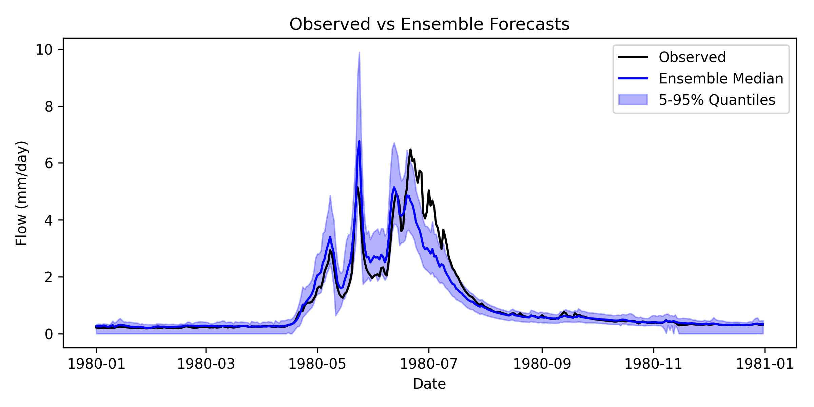
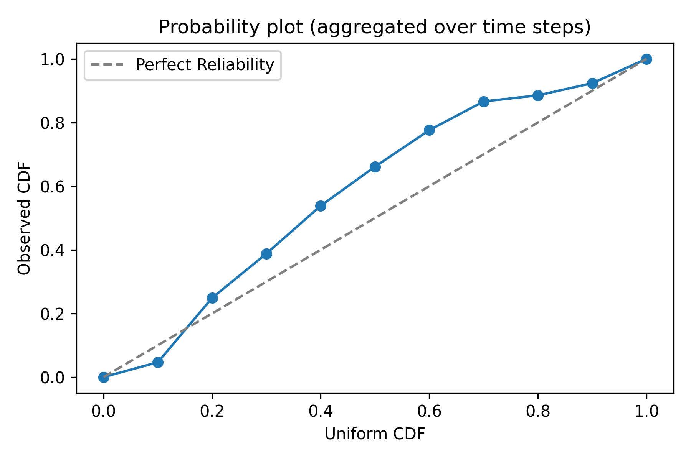
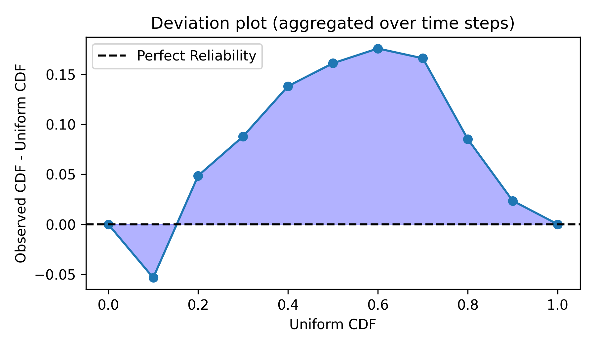
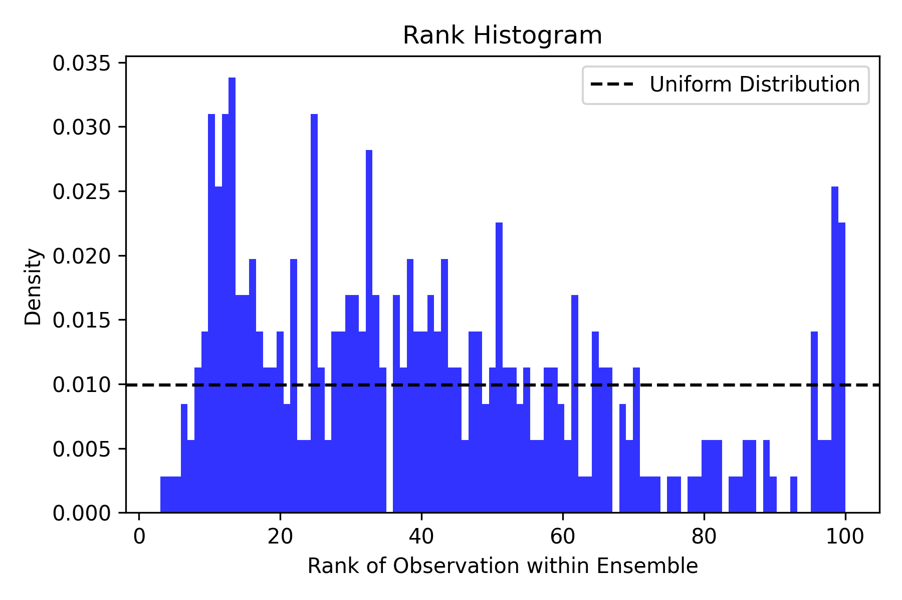
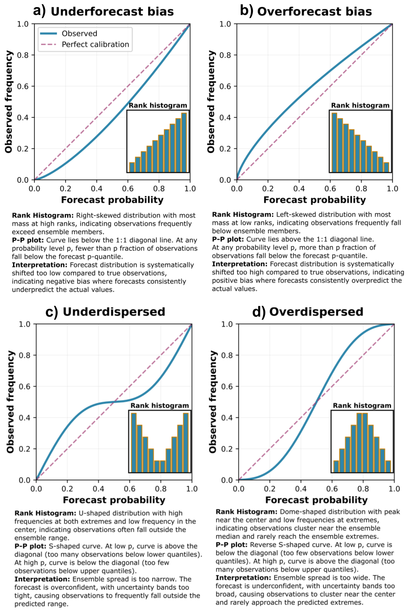

# Ensemble Forecast Verification

A Python-based workflow for verifying ensemble forecasts using reliability diagrams and some point-based and distribution-based performance metrics.


## Repository Structure
```
├── data/
│   └── site_1.csv               # Streamflow observations and ensemble forecasts for an arbitrary river site
├── figure/                      # Output figures generated by the notebook
├── forecast_verification.ipynb  # Main analysis notebook
```
---

## Getting Started

Open and run `forecast_verification.ipynb`. The notebook walks through data loading, visualization, reliability assessment, and performance scoring for an ensemble streamflow forecast at an arbitrary river site.

---

## Notebook Overview

### 1. Data Exploration

The notebook loads streamflow observations and ensemble forecasts from `site_1.csv` and visualizes them as a time series.



---

### 2. Reliability Diagrams

Three complementary diagrams assess whether the ensemble forecast is *reliable* — that is, whether the forecast distribution is statistically consistent with the observations. The core idea is that observations and forecasts should appear as if drawn from the same distribution.

#### a) Probability Plot

The probability plot assesses how well the forecast distribution matches the observed distribution. For each time step, each ensemble member is converted to a probability of exceedance (the fraction of ensemble members exceeding a given threshold). The probability of exceedance of the actual observation is then derived from the forecast distribution and recorded. This is repeated for all time steps.

In the discrete case used here, a set of thresholds is defined, and for each threshold the fraction of observations exceeding it is computed. If the forecast is reliable, 10% of observations should exceed the 10% threshold, 20% should exceed the 20% threshold, and so on. The resulting observed CDF is plotted against the uniform CDF. Points falling close to the 1:1 diagonal indicate a reliable forecast.



#### b) Deviation Plot

The deviation plot shows by how much the observed CDF deviates from the uniform CDF at each threshold — effectively a residual view of the probability plot. Points near the horizontal zero line indicate a reliable forecast.



#### c) Ranked Histogram

For each time step, the observation is ranked among the ensemble members by sorting the ensemble members and the observation together and recording the observation's position in the sorted list. This is repeated for all time steps, and the collected ranks are plotted as a histogram.

If the histogram is approximately uniform — each rank occurring with roughly equal frequency — the ensemble forecast is well-calibrated and reliable, meaning the observation is equally likely to fall anywhere within the ensemble. Deviations from uniformity (e.g., U-shaped, skewed, or peaked distributions) suggest the forecast is biased or poorly dispersed.



The combined reliability diagram below summarizes all three views together and provides guidance on how to interpret them:



---

### 3. Performance Metrics

Three metrics quantify forecast performance from different angles:

#### Nash-Sutcliffe Efficiency (NSE)

NSE measures point forecast performance by comparing the ensemble mean to the observations. It ranges from −∞ to 1, where 1 indicates a perfect forecast, 0 indicates the forecast performs no better than predicting the observed mean, and negative values indicate worse performance than that baseline (mean of observations).

$$\text{NSE} = 1 - \frac{\sum (O_i - F_i)^2}{\sum (O_i - \bar{O})^2}$$

Where $O_i$ are observed values, $F_i$ is the ensemble mean forecast at each time step, and $\bar{O}$ is the mean of the observations.

#### Continuous Ranked Probability Score (CRPS)

CRPS evaluates the performance of the full ensemble distribution against the observations. It ranges from 0 to ∞, where lower values indicate better performance and 0 is a perfect score. As a proper scoring rule, CRPS jointly rewards both *sharpness* (a concentrated forecast distribution) and *reliability* (a well-calibrated spread relative to the observations).

$$\text{CRPS} = \int_{-\infty}^{\infty} \left[ F(x) - \mathbf{1}(x \geq O) \right]^2 dx$$

Where $F(x)$ is the cumulative distribution function of the ensemble forecast and $O$ is the observed value.

#### Reliability Index (RI)

RI is the mean absolute deviation of the observed CDF from the uniform CDF, as seen in the deviation plot. It ranges from 0 to 0.5, where 0 indicates a perfectly reliable forecast and higher values indicate greater deviation from reliability.

$$\text{RI} = \frac{1}{N} \sum_{i=1}^{N} \left| \text{CDF}_{\text{obs},i} - \text{CDF}_{\text{uniform},i} \right|$$

Where $N$ is the number of thresholds, $\text{CDF}_{\text{obs},i}$ is the observed CDF at threshold $i$, and $\text{CDF}_{\text{uniform},i}$ is the uniform CDF at threshold $i$.